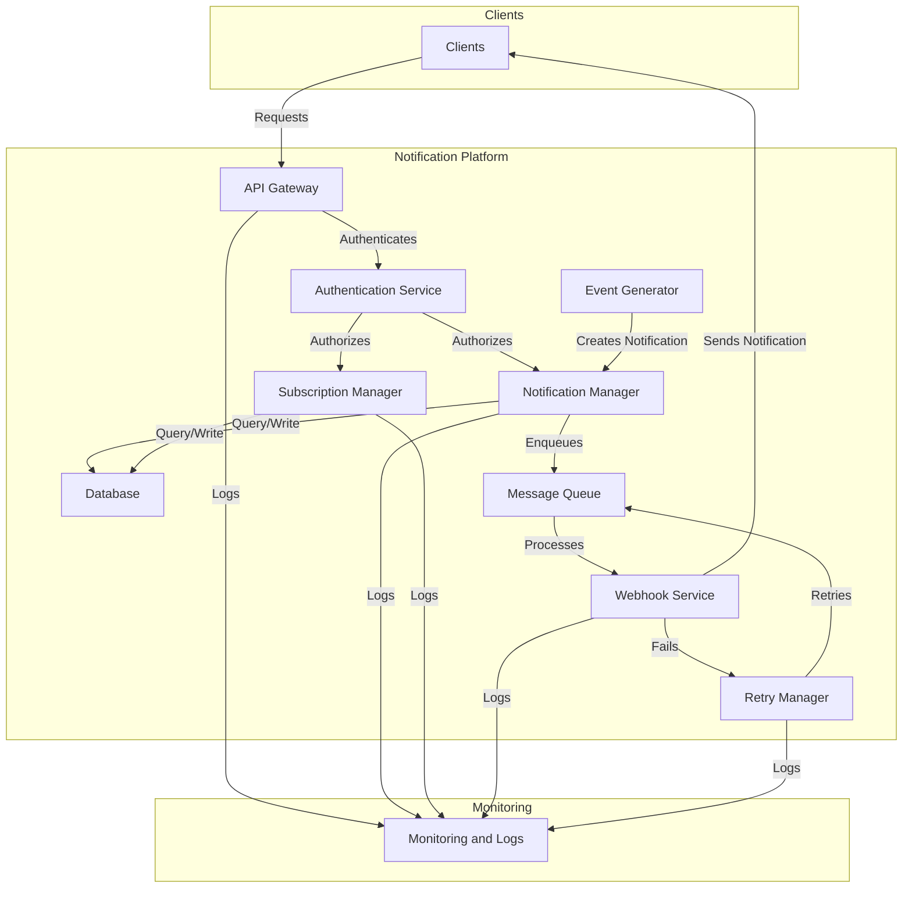

# Cobre Notification Platform - Technical Requirements

## Introduction

The Cobre notification platform is a cloud-native, event-based, microservices solution designed to manage transactional notifications. It allows clients to subscribe to specific events, receive notifications through webhooks, query events via a REST API, and handle retries in case of delivery failures. This document describes the technical requirements of the architecture, including components, services, endpoints, and implementation requirements.

## Objectives

- **Notification Delivery**: Send event notifications to client-configured webhook URLs, ensuring they are only delivered to the corresponding subscribers.
- **Self-Service API**: Provide a REST API for clients to query notifications, manage subscriptions, and request resends.
- **Error Handling**: Implement a robust retry strategy to ensure reliable notification delivery.
- **Observability**: Offer near real-time monitoring to detect deviations and respond quickly to issues.
- **Security**: Protect the platform against common vulnerabilities and ensure notification authenticity.

## General Architecture

The architecture follows a hexagonal design (ports and adapters) to ensure modularity, scalability, and maintainability. Below is a high-level diagram of the main components:

### Main Components

1. **Clients**: External users or systems that interact with the platform to manage subscriptions, query notifications, or receive webhooks.
2. **API Gateway**: Entry point for HTTP requests, managing authentication and routing.
3. **Authentication Service**: Verifies client identity and authorization (e.g., using JWT).
4. **Event Generator**: Creates notifications based on transactional events (e.g., payments, transfers).
5. **Notification Manager**: Manages notification creation, storage, and queuing.
6. **Subscription Manager**: Handles client subscriptions to specific event types.
7. **Database**: Stores notification and subscription data, supporting fast queries and filters.
8. **Message Queue**: Processes notifications asynchronously to ensure scalability.
9. **Webhook Service**: Sends HTTP notifications to client-configured URLs.
10. **Retry Manager**: Implements a retry strategy to handle delivery failures.
11. **Monitoring and Logs**: Provides near real-time observability through metrics and logs.

## Technical Requirements

### 1. Infrastructure Requirements

The platform must operate in a cloud-native environment, using managed services to minimize infrastructure management. Key services include:

- **Data Storage**: A scalable NoSQL database (e.g., DynamoDB) to store notifications and subscriptions, with support for secondary indexes for efficient filtering.
- **Message Queue**: A queuing system (e.g., SQS) with dead letter queue (DLQ) support for handling failures.
- **Serverless Processing**: Serverless functions (e.g., Lambda) to execute business logic, such as authentication, notification management, and webhook delivery.
- **API Gateway**: An HTTP gateway to expose REST endpoints with authentication and rate limiting.
- **Monitoring**: Observability tools (e.g., CloudWatch, X-Ray) for metrics, logs, and distributed tracing.

### 2. API Endpoints

The REST API must support the following functionalities:

- **Notification Management**:
  - `GET /notification_events`: Query all notifications for a client, with filters by date and delivery status.
  - `GET /notification_events/{id}`: Get details of a specific notification.
  - `POST /notification_events/{id}/replay`: Resend a failed notification.
  - `POST /notification_events`: Create a new notification (for events generated by external or internal systems).
  - `GET /notification_events/{id}/delivery_status`: Query the delivery status of a notification.
- **Subscription Management**:
  - `POST /subscriptions`: Subscribe to an event type with a webhook URL.
  - `PUT /subscriptions`: Update an existing subscription (e.g., change webhook URL).
  - `DELETE /subscriptions`: Cancel a subscription.
  - `GET /subscriptions`: List all active subscriptions for a client.
- **Security**:
  - `POST /notification_events/verify`: Verify the authenticity of a received notification (e.g., validating an HMAC signature).
  - `POST /auth/token`: Generate an authentication token to access the API.

### 3. Internal Services

The following internal services are necessary to support complete functionality:

- **Event Generator**: Creates notifications based on transactional events (e.g., payments, transfers). Must integrate with other Cobre systems to receive events.
- **Retry Manager**: Implements an exponential backoff strategy to retry failed notification deliveries (maximum 3 attempts, with delays of 1s, 2s, 4s). Persistent failures are moved to a dead letter queue.
- **Dead Letter Queue (DLQ) Processor**: Manages notifications that could not be delivered after maximum retries, archiving them or sending alerts.
- **Metrics and Dashboard Service**: Generates metrics (success rate, failures, latency) and dashboards for near real-time monitoring.
- **Configuration Manager**: Manages global parameters such as retry thresholds, timeouts, and signing keys.

### 4. Operation Flow

1. **Notification Creation**:
   - An event occurs in the Cobre platform (e.g., a payment).
   - The **Event Generator** creates a notification and passes it to the **Notification Manager**.
   - Subscription is verified in the **Subscription Manager**.
   - The notification is stored in the **Database** and enqueued in the **Message Queue**.
2. **Notification Delivery**:
   - The **Webhook Service** consumes messages from the **Message Queue**.
   - Sends an HTTP POST request to the client's webhook URL.
   - Updates delivery status in the **Database**.
3. **Retries**:
   - If delivery fails, the **Retry Manager** re-enqueues the notification with an exponential delay.
   - After 3 failed attempts, the notification is moved to the dead letter queue.
4. **Query and Management**:
   - Clients use the API to query notifications, manage subscriptions, or request resends.
   - All requests are authenticated and authorized.
5. **Monitoring**:
   - Each action generates logs and metrics, visible in dashboards for the internal team.

### 5. Security Requirements

The platform must mitigate at least the following OWASP Top 10 vulnerabilities:

- **A01: Broken Access Control**:
  - **Mitigation**: Use JWT-based authentication and verify that clients only access their own data (e.g., `client_id` in requests).
  - **Implementation**: Configure an authentication service that validates tokens in each request.
- **A03: Injection**:
  - **Mitigation**: Sanitize all API inputs and use parameterized queries in the database.
  - **Implementation**: Validate and escape data in REST endpoints.
- **A07: Cross-Site Scripting (XSS)**:
  - **Mitigation**: Escape data in API responses and configure security headers (e.g., Content-Security-Policy).
  - **Implementation**: Use a framework that automatically handles output sanitization.
- **Additional**: Sign notifications with HMAC to ensure their authenticity in the `/notification_events/verify` endpoint.

### 6. Performance and Scalability Requirements

- **Latency**: API queries must respond in < 200ms (95th percentile).
- **Scalability**: The system must support up to 10,000 notifications per second at peak.
- **Availability**: 99.9% uptime, with automatic failure handling through queues and retries.
- **Storage Capacity**: Retain notifications for 30 days (configurable with TTL).

### 7. Observability Requirements

- **Metrics**:
  - Successful/failed delivery rate per client.
  - Average delivery latency.
  - Number of retries per notification.
  - Dead letter queue message volume.
- **Logs**: Record details of each request, delivery, and error.
- **Dashboards**: Provide near real-time views of system status.
- **Alerts**: Notify the team of recurring failures or spikes in the dead letter queue.

## Recommended Implementation

- **Language and Framework**: TypeScript with Serverless Framework for a serverless environment.
- **Architecture**: Hexagonal to separate business logic from infrastructure details.
- **Infrastructure Services**:
  - **Database**: Scalable NoSQL with secondary indexes.
  - **Message Queue**: Queuing system with DLQ support.
  - **Processing**: Serverless functions for business logic.
  - **API**: HTTP Gateway with JWT authentication.
  - **Monitoring**: Tools for metrics, logs, and distributed tracing.
- **Code Structure**:
  - `core/`: Domain models, ports, and exceptions.
  - `application/`: Use cases implementing business logic.
  - `adapters/primary/`: API and queue handlers.
  - `adapters/secondary/`: Repositories, clients, and policies (e.g., retries).
  - `config/`: Infrastructure configurations.
  - `lib/`: Utilities such as logging and error handling.

## Final Considerations

- **Testing**: Implement unit tests for use cases and integration tests for handlers and repositories.
- **CI/CD**: Configure a pipeline for automatic deployments and testing.
- **Documentation**: Keep API documentation updated (e.g., with OpenAPI/Swagger).
- **Future Scalability**: Design to allow integration with other event systems through an event bus (e.g., EventBridge).

This document provides a solid foundation for implementing the Cobre notification platform, aligned with the functional and non-functional requirements described.

----------

**Creation Date**: May 11, 2025  
**Author**: Cobre Development Team  
**Version**: 1.0