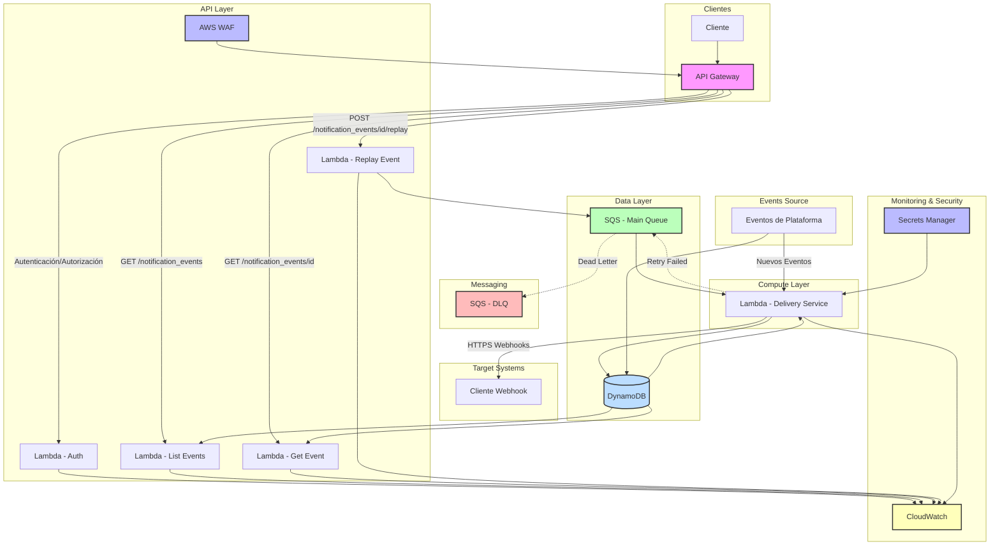

# Arquitectura del Sistema de Notificaciones

## Diagrama de Arquitectura

# Explicación del Diagrama de Infraestructura AWS

El diagrama que he creado muestra la arquitectura esencial de AWS necesaria para implementar el sistema de notificaciones de eventos de Cobre. A continuación, explico cada componente:

## Flujo de Trabajo Principal

1.  **Eventos Source**: Los eventos se generan en la plataforma Cobre (transacciones, actualizaciones, etc.)
2.  **Data Layer**:
    -   Las notificaciones se almacenan en **DynamoDB** con la estructura vista en el JSON de ejemplo
    -   Incluye campos como `event_id`, `event_type`, `content`, `delivery_status`, etc.
3.  **Messaging**:
    -   **SQS (Main Queue)** recibe los eventos para procesamiento asíncrono
    -   **SQS (DLQ)** captura notificaciones que no pueden entregarse después de los reintentos
4.  **Compute Layer**:
    -   **Lambda - Delivery Service** procesa la cola y envía notificaciones a las URLs de webhooks
    -   Actualiza el estado de entrega en DynamoDB
    -   Implementa lógica de reintentos para entregas fallidas
5.  **Target Systems**:
    -   Los webhooks de los clientes reciben las notificaciones vía HTTPS

## API de Autoservicio

1.  **API Layer**:
    -   **API Gateway** expone los endpoints REST requeridos
    -   **WAF** protege la API contra vulnerabilidades de seguridad
2.  **Lambdas para API**:
    -   **Lambda - List Events**: Implementa `GET /notification_events`
    -   **Lambda - Get Event**: Implementa `GET /notification_events/{id}`
    -   **Lambda - Replay Event**: Implementa `POST /notification_events/{id}/replay`
    -   **Lambda - Auth**: Maneja autenticación y autorización
3.  **Clientes**: Consumen la API para consultar y gestionar sus notificaciones

## Monitoring & Security

-   **CloudWatch**: Proporciona logs, métricas y alarmas para la observabilidad en tiempo real
-   **Secrets Manager**: Gestiona credenciales y tokens de autenticación para webhooks