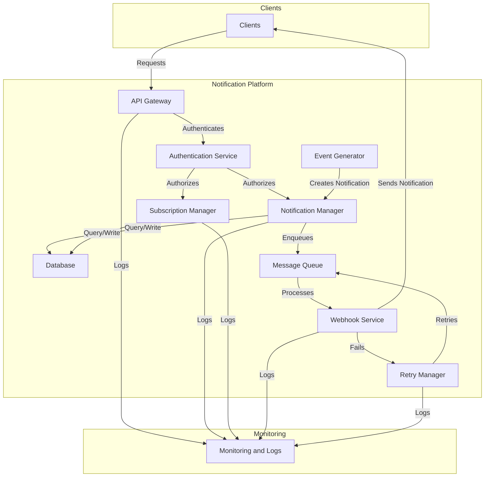

# Notification System Architecture

## Architecture Diagram

## General Description

The notification system is designed to provide a robust and scalable platform for delivering events to clients through webhooks. The architecture is built on AWS and follows distributed systems design principles.

## Main Components

### 1. API Layer
- **API Gateway**: Main entry point handling all HTTP requests
  - Implements rate limiting and throttling
  - Handles request validation
  - Provides OpenAPI/Swagger documentation
- **AWS WAF**: Protection against common web attacks
  - Custom rules for specific protection
  - Integration with AWS Shield for DDoS

### 2. Compute Layer
- **Lambda Functions**:
  - **Auth**: Handles JWT authentication and role-based authorization
  - **List Events**: Implements pagination and filtering
  - **Get Event**: Retrieves specific event details
  - **Replay Event**: Allows resending failed events
  - **Delivery Service**: Processes event queue and handles retries

### 3. Data Layer
- **DynamoDB**:
  - Main events table with secondary indexes
  - TTL for old events
  - Auto-scaling capability
  - Data structure optimized for frequent queries

### 4. Messaging
- **SQS Main Queue**:
  - Asynchronous event processing
  - Configurable visibility
  - Messages encrypted in transit
- **DLQ (Dead Letter Queue)**:
  - Captures failed events after retries
  - Allows manual analysis and reprocessing

### 5. Monitoring & Security
- **CloudWatch**:
  - Custom metrics for latency and success
  - Centralized logs
  - Alarms for critical events
- **Secrets Manager**:
  - Secure credential management
  - Automatic secret rotation

## Design Considerations

### Scalability
- Serverless architecture that scales automatically
- DynamoDB data partitioning
- Parallel event processing
- Per-client rate limiting

### Availability
- Multiple AZs for high availability
- Automatic retries for temporary failures
- Circuit breakers for external endpoints
- Data backup and recovery

### Security
- Encryption in transit and at rest
- JWT authentication
- Role-based authorization
- Access auditing

### Monitoring
- End-to-end latency metrics
- Delivery success rate
- Resource usage
- Proactive alerts

## Workflows

### 1. New Event Processing
1. Event generated in the platform
2. Storage in DynamoDB
3. Sending to SQS
4. Processing by Lambda Delivery Service
5. Delivery to client webhook
6. State update in DynamoDB

### 2. Event Query
1. Client authentication
2. Permission validation
3. DynamoDB query
4. Paginated response to client

### 3. Event Replay
1. Permission validation
2. Original event retrieval
3. Resending to SQS queue
4. Normal event processing

## Implemented Best Practices

1. **Idempotency**: All endpoints are idempotent
2. **Traceability**: Each event has a unique ID and timestamp
3. **Resilience**: Failure handling and retries
4. **Observability**: Complete logging and metrics
5. **Security**: Robust encryption and authentication