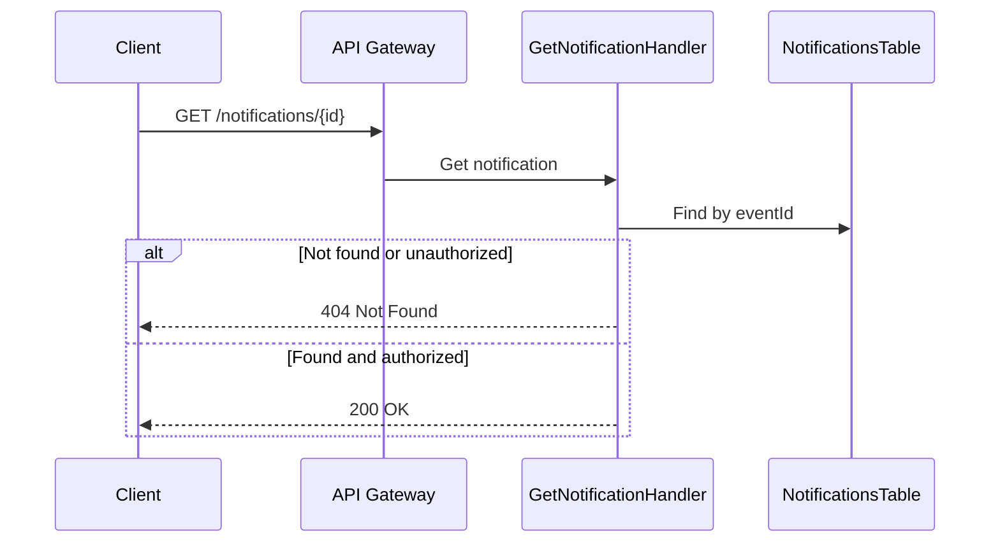

# Get Notification Flow

This diagram shows the flow for retrieving a notification by ID.

## Flow Description

1. **Request**
   - Client requests a specific notification by ID
   - System validates authorization

2. **Response**
   - Returns notification if found and authorized
   - Returns 404 if not found or unauthorized 