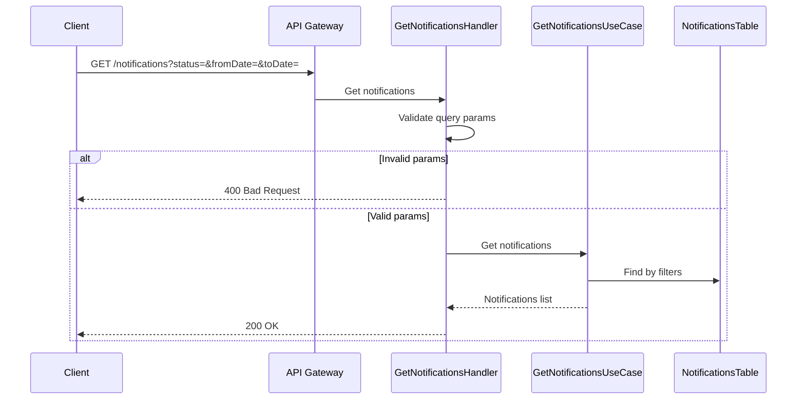

# Get Notifications Flow

This diagram shows the flow for retrieving multiple notifications with filters.

## Flow Description

1. **Request Parameters**
   - Optional filters:
     - status: Filter by delivery status
     - fromDate: Filter by start date
     - toDate: Filter by end date

2. **Validation**
   - Validates query parameters format
   - Converts date strings to Date objects
   - Returns 400 for invalid parameters

3. **Data Retrieval**
   - System retrieves notifications matching filters
   - Results are mapped to DTO format
   - Returns list of notifications

4. **Logging**
   - Logs request parameters
   - Logs number of notifications found
   - Logs any errors that occur 