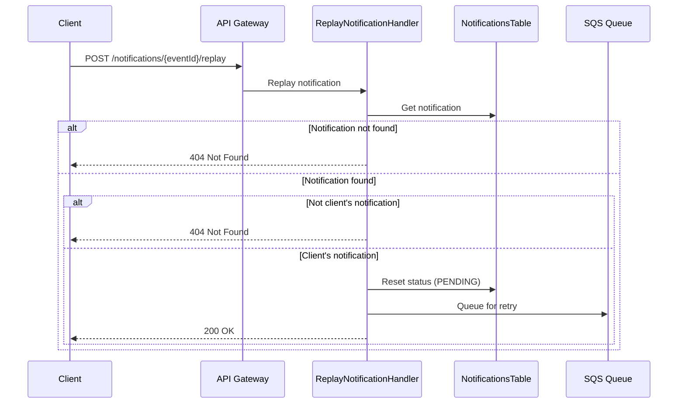

# Notification Replay Flow

This diagram shows the flow for replaying a failed notification.

## Flow Description

1. **Replay Request**
   - Client requests to replay a specific notification
   - System verifies notification exists and belongs to client
   - If not found or unauthorized, returns 404

2. **Reset & Retry**
   - System resets notification status to PENDING
   - Message is queued for reprocessing
   - Client receives success response

3. **Security**
   - Each client can only replay their own notifications
   - Unauthorized requests are rejected with 404 