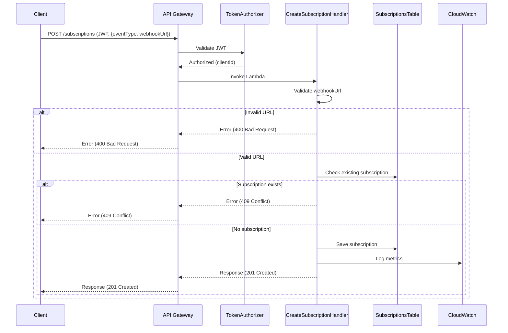

# Subscription Creation Flow

This diagram shows the complete flow for creating a new subscription in the system.

## Flow Description

1. The client sends a POST request to the API Gateway with:
   - JWT token for authentication
   - Event type to subscribe to
   - Webhook URL to receive notifications

2. The API Gateway validates the JWT token through the TokenAuthorizer
   - If the token is valid, the clientId is extracted
   - If the token is invalid, the request is rejected

3. The API Gateway invokes the CreateSubscriptionHandler Lambda function

4. The Lambda function performs the following validations:
   - Validates that the webhook URL is valid
   - Verifies that there is no existing subscription for the same client and event type

5. If all validations are successful:
   - The new subscription is saved in the subscriptions table
   - Logs and metrics are recorded in CloudWatch
   - A 201 Created response is returned

6. In case of errors:
   - Invalid URL: 400 Bad Request
   - Existing subscription: 409 Conflict
   - Other errors: 500 Internal Server Error 