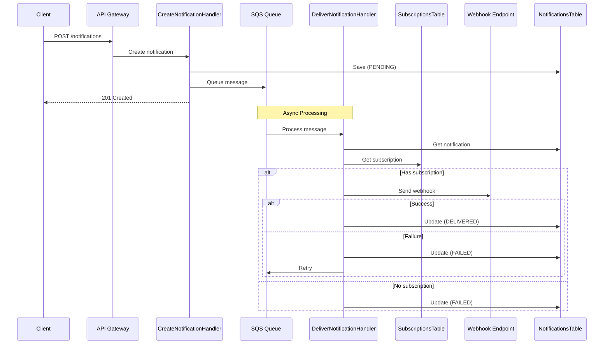

# Webhook Notification Flow

This diagram shows the main flow for delivering a notification to a webhook endpoint.

## Flow Description

1. **Create Notification**
   - Client creates a notification
   - System saves it as PENDING
   - Message is queued for processing

2. **Process Notification**
   - System retrieves notification and subscription
   - If subscription exists:
     - Attempts to deliver to webhook
     - Updates status based on result
   - If no subscription:
     - Marks as FAILED

3. **Error Handling**
   - Failed deliveries are retried
   - All errors are logged
   - Each message is processed independently 